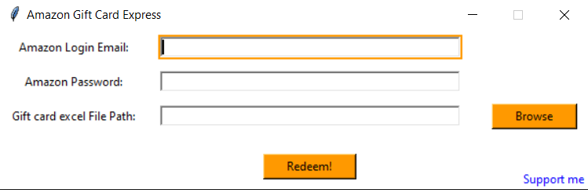
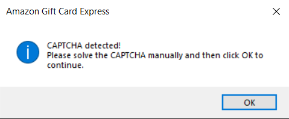

# Amazon Gift Card Express

This project is designed to read emails from Amex Gyfter, extract gift card codes, and add them to an Amazon account. It automates the process of managing gift cards for users.

## Project Structure

```
AmazonGiftCardExpress
├── src
│   ├── AmazonGiftCardExpress.py # Manages interaction with Amazon account via GUI
│   ├── ExtractGiftCard.gs       # Extracts gift card codes from Gmail
├── requirements.txt            # Project dependencies
└── README.md                   # Documentation for the project
```

## Prerequisites

Before you begin, ensure you have met the following requirements:
- You have Python installed on your machine.
- You have Google Chrome installed on your machine.
- You have an Amazon account.
- You have access to the email account where you receive gift card codes from Amex Gyfter.

## Setup Instructions

1. **Clone the repository:**
   ```
   git clone <repository-url>
   cd AmazonGiftCardExpress
   ```

2. **Install dependencies:**
   Make sure you have Python installed. Then, run:
   ```
   pip install -r requirements.txt
   ```

3. **Install Chrome WebDriver:**
   - Download the Chrome WebDriver from the [ChromeDriver download page](https://sites.google.com/a/chromium.org/chromedriver/downloads).
   - Extract the downloaded file to a directory of your choice.
   - Add the directory containing `chromedriver.exe` to your system PATH.

## Usage Guidelines

1. **Extract Gift Card Codes from Gmail:**
   Below are the steps to extract the gift card codes from Gmail:
   1. Open [Google Apps Script](https://script.google.com/home) and sign in with your Gmail account where you have received the Amazon gift card.
   2. Click on the "New Project" button on the top left corner.
   3. Copy the code from `ExtractGiftCard.gs` and paste it into the browser's code window.
   4. Click on the "Save" button and run the code.
   5. Once the code is executed, it will be saved to your Google Drive with the name `Gift_Card_Codes_<executiondate>.xlsx`. Download that to your local machine.

2. **Use the Amazon Gift Card Express GUI:**
   Execute the main script to start the process:

   ```
   python src/AmazonGiftCardExpress.py
   ```
   - Enter your Amazon login email and password, then click **Connect Amazon**.
   - After the Amazon browser session opens, paste one gift card code per line into the code box. For example:
     ```
     KA7C-TC8DNA-DYVW
     6N7U-DPFVFU-BENB
     4FMY-PKFRP4-RNKV
     ```
   - Click **Redeem!** to add all pasted codes using the same connected Amazon session.
   - Codes are processed in batches of up to six parallel browser sessions to reduce wait time.
   - Each code's result is also printed in the terminal as `CLAIMED`, `ALREADY CLAIMED`,
     `INVALID`, `NOT REDEEMABLE`, or `UNKNOWN`.
   - The account is connected only once per app session; the credentials are not saved to disk.
   - If a CAPTCHA screen appears when adding the gift card code, the tool will prompt you to solve the CAPTCHA manually and click OK to continue.




3. **Check Amazon Account:**
   After running the script, verify that the gift card codes have been successfully added to your Amazon account.

## Contributing

Contributions are welcome! Please feel free to submit a pull request or open an issue for any enhancements or bug fixes.

Enjoyed this? Consider supporting me!<br>
<a href="https://www.buymeacoffee.com/kedargmnv" target="_blank"></a>
